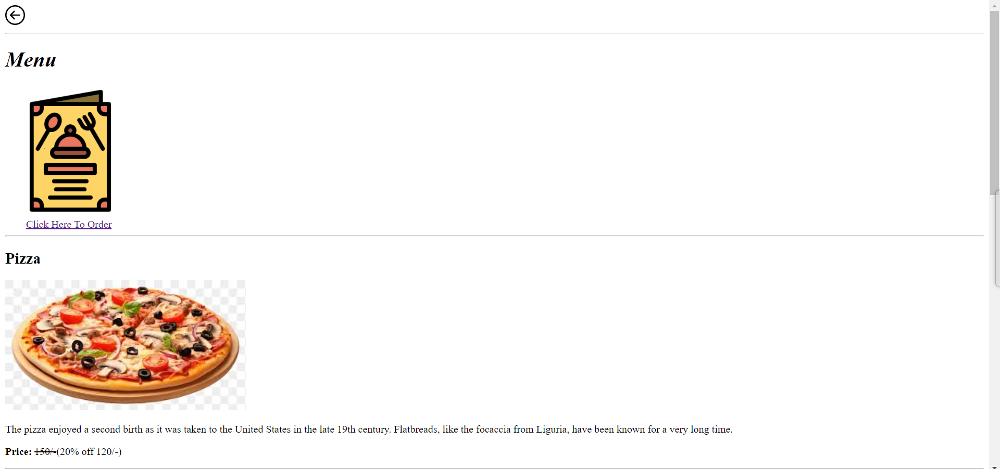
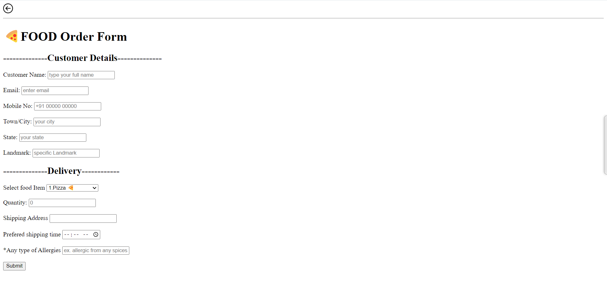
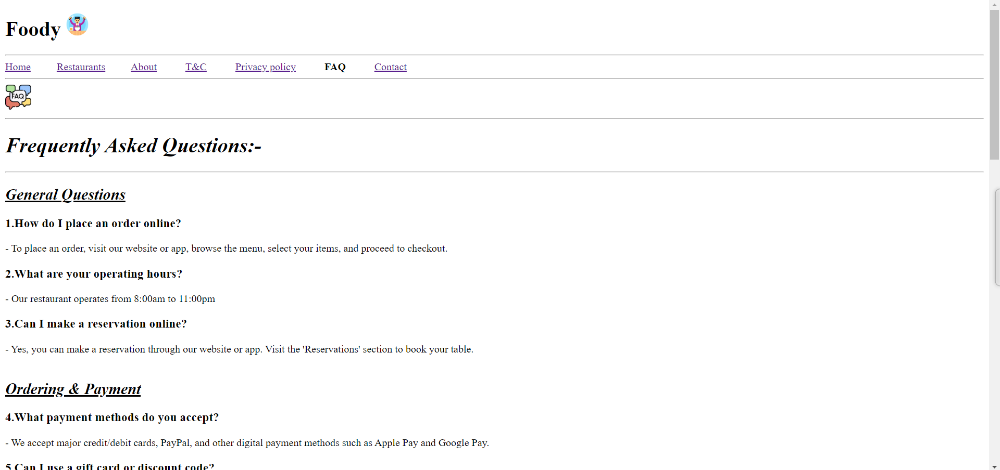

# Foody Website

## Overview

Foody is a comprehensive food service website that allows users to browse various restaurants, explore different menus, place orders, and much more. Our platform ensures a seamless experience for users looking for their favorite foods and easy pickups.

**Hosted Link:** [Foody Website](https://foodflyte.netlify.app/)

## Table of Contents

1. **Homepage:**  

   The homepage is the entry point of the Foody website. It features a navigation menu, a main banner with an inviting headline and image, a food gallery showcasing popular dishes, a promotional section highlighting current deals, and a footer with links to Foody's social media pages.

2. **Restaurant Listings:**  

   This page provides a comprehensive list of all the restaurants available on the Foody platform. Users can browse through the list of restaurants and utilize search and filter functionalities to find restaurants based on specific criteria such as location, cuisine, and ratings.

3. **Restaurant Details:** 
 
   Detailed information about each restaurant, including menu items with descriptions and prices, location and contact details, and customer reviews and ratings to help users make informed decisions.

4. **Menu Page:**  

   A detailed view of the dishes offered by a selected restaurant. It includes high-quality images of each dish, detailed descriptions, ingredients, pricing information, and options for customization and add-ons.

5. **Order Form:**  

   A user-friendly page allowing users to place orders. It features input fields for customer information, selection options for delivery or pickup.

6. **About Us:**  

   Information about the Foody team and its mission. It includes the story behind the creation of Foody, an introduction to team members, and Foody's commitment to delivering quality service and customer satisfaction.

7. **FAQ:**  

   Addresses common questions and issues users might have. It covers information on account creation and management, details on ordering and payment processes, and options for delivery and pickup.

8. **Terms and Conditions:** 
 
   Outlines the legal guidelines for using the Foody platform, including user rights and responsibilities, guidelines for acceptable content and conduct, and legal disclaimers and limitations of liability.

9. **Privacy Policy:**  

   Details how Foody collects, uses, and protects user data. It includes an overview of data collection practices, information on user rights regarding their personal information, and measures taken to ensure data security and privacy.

10. **Contact Us:**  

    Provides various ways for users to get in touch with the Foody team, including a contact form for inquiries and feedback, email and phone contact details, and office address and working hours for further assistance.

## Team Members

- Abhi
- Parikshit
- Vedanti
- Mansi
- Vaishnavi Shinde
- Samradnya
- Tharkeshwari
- Jayvardhan
- Saba
- Bhakti

## Project Structure

```plaintext
Foody/
├── images/
│   ├── foodie.png
│   ├── home food.jpg
│   ├── paneer masala.jpg
│   ├── veg-biryani.jpg
│   ├── vada pav.jpg
│   ├── Sev-Bhaji.jpg
│   ├── Chicken.jpg
│   ├── espress.jpg
│   ├── noodle roll.jpg
│   ├── Momos.jpg
│   └── gift.png
├── pages/
│   ├── restaurant_listing.html
│   ├── about.html
│   ├── terms.html
│   ├── privacy.html
│   ├── faq.html
│   ├── contact.html
│   └── deals.html
└── index.html
